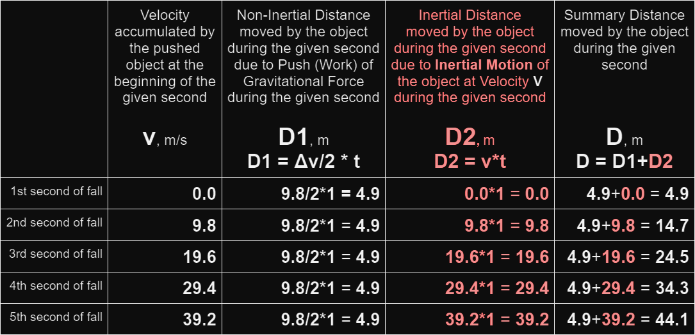

# New Discoveries Changing All Science

Hello the world.

All I have is logic.

In my opinion, modern/official science is a religion being accepted by faith. Actually, the situation is even much worse than that, the scientific system itself is a religious sect.

More on it below.

FIRST OF ALL 
THIS IS EASY TO UNDERSTAND 
ABOUT THE DISCOVERIES IN BRIEF 
BRIEF INTRODUCTION 
CONTEXT IN BRIEF 
START 

## FIRST OF ALL

Some time ago, just through thinking logically about well-known facts, I made the biggest ever scientific discoveries.

The discoveries are so big that they directly affect philosophy, physics, chemistry, biology, and eventually will change all science as we know it.

Simultaneously, the discoveries are very simple and obvious.

Thanks to these discoveries, at best 

* the world will have the ability to REALLY prosper; 

* people will become more financially secure, have more free time (less working time), and can significantly improve their lives, making them more fulfilled, happier and longer; 

* we as civilization will improve our understanding of the Universe and, in general, our thinking.

## THIS IS EASY TO UNDERSTAND

This article explaining the discoveries was written in such a way as to be understandable to everyone. So you are fully able to easily understand everything, even if you have no scientific background.

In particular, if you know the multiplication table and can understand these simple mathematical examples:

2 * 2 = 4 
20 * 9.8 = 196

you are fully able to easily understand every thing in this article.

Throughout the entire article, I practice “redundancy of understandability”, using very simple language and sometimes explaining the same things several times and in various ways.

Always feel free to ask me any questions about the discoveries: theOlegGor@gmail.com

English is my second language, and I started learning it when I was 39, and made these discoveries when I was 45.

## ABOUT THE DISCOVERIES IN BRIEF

| Syntax      | Description | Syntax      | Description | Syntax      | Description | Syntax      | Description | 
| ----------- | ----------- | ----------- | ----------- | ----------- | ----------- | ----------- | ----------- |
| Header      | Title       | Header      | Title       | Header      | Title       | Header      | Title       |
| Paragraph   | Text        | Paragraph   | Text        | Paragraph   | Text        | Paragraph   | Text        |
