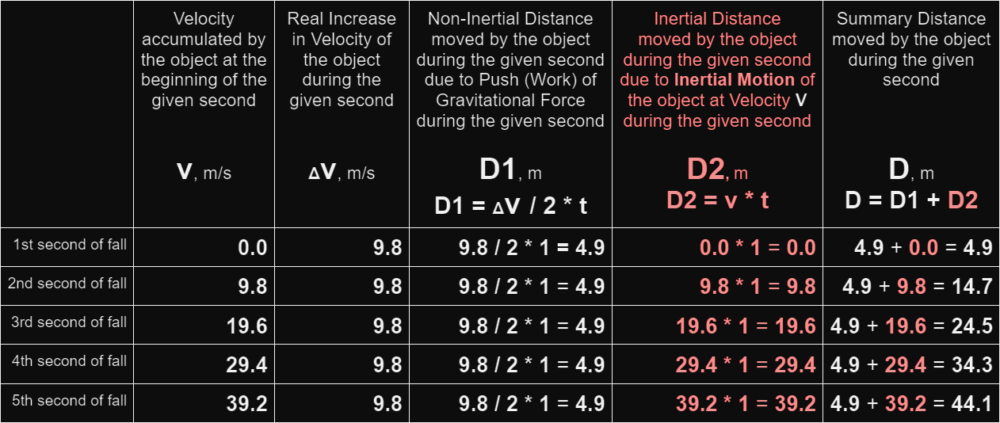

# New Discoveries Changing All Science

Hello the world.

All I have is logic.

In my opinion, modern/official science is a religion being accepted by faith. Actually, the situation is even much worse than that, the scientific system itself is a religious sect.

More on it below.

FIRST OF ALL 
THIS IS EASY TO UNDERSTAND 
ABOUT THE DISCOVERIES IN BRIEF 
BRIEF INTRODUCTION 
CONTEXT IN BRIEF 
START 

## FIRST OF ALL

Some time ago, just through thinking logically about well-known facts, I made the biggest ever scientific discoveries.

The discoveries are so big that they directly affect philosophy, physics, chemistry, biology, and eventually will change all science as we know it.

Simultaneously, the discoveries are very simple and obvious.

Thanks to these discoveries, at best 

* the world will have the ability to REALLY prosper; 

* people will become more financially secure, have more free time (less working time), and can significantly improve their lives, making them more fulfilled, happier and longer; 

* we as civilization will improve our understanding of the Universe and, in general, our thinking.

## THIS IS EASY TO UNDERSTAND

This article explaining the discoveries was written in such a way as to be understandable to everyone. So you are fully able to easily understand everything, even if you have no scientific background.

In particular, if you know the multiplication table and can understand these simple mathematical examples:

2 * 2 = 4 
20 * 9.8 = 196

you are fully able to easily understand every thing in this article.

Throughout the entire article, I practice “redundancy of understandability”, using very simple language and sometimes explaining the same things several times and in various ways.

Always feel free to ask me any questions about the discoveries: theOlegGor@gmail.com

English is my second language, and I started learning it when I was 39, and made the discoveries when I was 45.

## ABOUT THE DISCOVERIES IN BRIEF

Some time ago, I made scientific discoveries about Force, Work and Energy that cardinally change/improve our understanding the Universe.

Since Energy, as THE source for every event in the Universe, is the main concept in the chief sciences, these discoveries, as said above, directly affect philosophy, physics, chemistry, biology, and eventually will change all science as we know it.

Importantly, at the start of the process, I also discovered the existence of the biggest, LITERALLY-CRYING, logical mistakes in the very fundamentals of science that right now are strongly hindering the progress of our civilization.

Remarkably, the discoveries are fully based on well-known experiments and well-known Newton’s discoveries (1st, 2nd and 3rd Newton’s Laws) which, ATTENTION, were and still are not fully understood by people.

## BRIEF INTRODUCTION

<i>This Brief Introduction is mostly for experts, so if you are a normal person you might just skip this part</i>

In order for you to get an idea of how big the whole wrongness of modern/official science is, here is a description of just 2 of the fundamental mistakes that I discovered.

#### SUFFICIENT FUNDAMENTAL MISTAKE IN SCIENCE

Even this single mistake destroys the entire concept of modern/official science of understanding the Universe.

This mistake is sufficient.

The mistake is based on the fact that modern/official science fails to even understand what is THE REAL REASON that a free-falling object during every second is moving the distance different in size.

  

We (people) know all these exact numbers about “free-falling“ by well-known experiments.

For example, modern/official science even fails to understand what is the real reason that a free-falling apple during every second is moving the distance different in size:

in particular, the apple is moving the shorter distance of 4.9 meters during the 1st second and the longer distance of 14.7 meters during the 2nd second.

The difference in the distances is 9.8 meters.

Unfortunately, modern/official science mistakenly believes that the real reason for the difference in the distances is Gravitational Force.

But the real reason IS NOT Gravitational Force.

The real reason is Inertia. 

Unfortunately, modern/official science absolutely fails to understand this.

As a consequence of the misunderstanding, for now, all scientists (all existing science textbooks) have the absolutely wrong concept of Work and hence have the absolutely wrong concept of Energy. As a result, all the existing formulas for calculating Work (W) and Energy (E), including these basic formulas,

are absolutely wrong.

The Joule, in its turn, is the absolutely wrong unit of measure for Work and Energy.

As said above, even this single mistake is SUFFICIENT, it destroys the entire concept of modern/official science of understanding the Universe.

<i>The mistake is explained in detail below in this article.</i>

####  ANOTHER FUNDAMENTAL MISTAKE IN SCIENCE

Another Fundamental Mistake is that in modern/official science, the Concept of Static Mechanical Work is wrongly missing.

So, for example, all scientists (all existing science textbooks), for now, CORRECTLY consider that the person on the left (lifting the 2 kg object upwards) is doing Mechanical Work and is spending their Energy (Resource) on this Work;

BUT all scientists (all the existing science textbooks), for now, INCORRECTLY consider that the person on the right (holding the 20 kg object motionless in the air) is NOT DOING Mechanical Work and is NOT SENDING their Energy (Resource) on this Work!

But in my opinion, the person on the right (holding the 20 kg object motionless in the air) is also doing Mechanical Work (Static Mechanical Work) and is spending their Energy (Resource) on this Work. And even moreover, the person on the right is doing a bigger amount of Mechanical Work than the person on the left is doing. Plus, the person on the right is spending a bigger amount of their Energy (Resource) on Mechanical Work than the person on the left is doing.

Due to the this mistake — due to the Absence of the Concept of Static Mechanical Work in science — the vast majority of processes in the Universe right now are being fallen out of our sight, and hence understanding. For this reason, humanity has the absolutely wrong picture of the physical world and is losing gigantic opportunities.

This mistake is also just one of the biggest, LITERALLY-CRYING, logical mistakes in the very fundamentals of science.

The Concept of Static Mechanical Work is explained in detail below in this article.

CONTEXT IN BRIEF

As said above, there are the biggest, LITERALLY-CRYING, logical mistakes in the very fundamentals of science that right now are strongly hindering the progress of our civilization.

How is this all possible?

In my opinion, all the biggest fundamental mistakes in science occurred because people, as said above, didn’t and still don’t fully understand Newton’s discoveries. Even though this might seem impossible, the fact of this misunderstanding is true.

Isaac Newton: A Not-Fully-Understood Scientific Genius

What about “official” science?

As said above, in my opinion, “official” science is a religion being accepted by faith. Actually, the situation is even much worse than that, the system itself is a religious sect.

In reality, all entrances in this system for everyone else are closed. The entrance for any new person is ONLY possible on recommendations of members of this religious sect. But getting the recommendations (endorsements) is absolutely impossible when the person dares to say things that are logical but different from those that have been written in the religious books (somehow called “textbooks”).

Moreover, the religious sect’s members always desperately cast stones at everyone who dares to say things that are logical but (yes, again) different from those that have been written in their religious books, and this is always so without allowing any open public discussion.

The today’s situation is that if any clever person wants to enter “official” science, first they must humiliate their own intellect, essentially they must DEGRADE their own intellect because the fundamental mistakes existing in “official” science are too big and obvious, it is impossible not to see them.

In my Open Letter to Elon Musk, I explain why exactly all “official” physics scientists around the world (including even those who privately agreed with these discoveries) publicly are, and will likely always be against an announcement of these discoveries (Spoiler: only because they have personal reasons for this).

Open Letter to Elon Musk

scientistzer0.substack.com/p/open-letter-to-elon-musk

START

ATTENTION: This whole work is strictly based on well-known experiments and consistent logical conclusions. Because of that it is very important to read this document from the very beginning, consistently and carefully (step by step, line by line) without any skip.

____

COMPULSORY PART

“OFFICIAL” CONCEPTS & FORMULASA. “Official” Concept of Force (“Official” Newton’s Formula for Force);B. “Official” Concept of Work and “Official” Concept of Energy.

NEW DISCOVERIES CHANGING ALL SCIENCE

Discovery #1

FUNDAMENTAL MISTAKES IN “OFFICIAL” SCIENCE1.1. Sufficient Fundamental Mistake in “Official” Science;1.2. Endless Series of Fundamental Mistakes in “Official” Science.

Discovery #2

NEW FORMULAS OF FORCE, WORK, ENERGY, POWER2.1. Target Acceleration for each Force;2.2. New Concept of Force;2.3. New Formula for Force or True Newton’s Formula for Force;2.4. Work and Energy in the Most General Sense;2.5. New Concept of Work and New Concept of Energy;2.6. New Universal Formula for Work and Energy;2.7. New Unit of Measure for Work and Energy;2.8. Static Mechanical Work;2.9. New Formula for Kinetic Energy;2.10. New Formula for Potential Energy;2.11. New Formula for Power.

Discovery #3

NEW LAW OF CONSEVATION OF ENERGY & FREE CLEAN ENERGY3.1. Precedents of Conservation of Energy;3.2. Energy-Isolated & Energy-Non-Isolated Systems;3.3. Free Clean Energy;3.4. New Law of Conservation of Energy;3.5. Various Ways of Multiplication of Force, Work, Energy ;3.6. New Energy & New Ability of Magnets;3.7. New-Generation Generator of Electrical Energy.

Discovery #4 ( hidden)

4.1. First Correct Explanation of Bernoulli’s Equation;4.2. New Concept of Charge;4.3. New Concept of Mass;4.4. New Concept of Electric Current.

First, the world needs to understand Discoveries #1, 2, 3, then Discovery #4 will be unveiled. Step by step.

Truth can be more surprising than Fiction

COMPULSORY PART

“OFFICIAL” CONCEPTS & FORMULAS

A. “Official” Concept of Force (“Official” Newton’s Formula for Force);B. “Official” Concept of Work and “Official” Concept of Energy.

__________

A. “Official” Concept of Force (“Official” Newton’s Formula for Force)

Foremost, before we start, it is important to understand that modern/official science considers that the Universe/Nature in the whole is a big organism which is much similar to your organism; and just like your organism, this Big Organism can do some work and always, just like your organism, this Big Organism must spend some resource (energy) of the organism on this work.

I absolutely agree with this.

More detail on this we will be getting throughout the way.

Now, let’s start from the very beginning — from the “official” concept of Force.

Here is the most simple and simultaneously exact definition of Force:

Force is a push.

In other words:

Force is the process of pushing an object in a certain direction.

The green arrow shows the direction of the pushing.

For example, when your organism (specifically, your hand) is pushing some strong wall with some great effort,

Your hand creates Force

your hand creates a push (process of pushing), and it means your hand creates Force.

In other words:

Force is when something is pushing an object.

In the given case, your hand is pushing the wall.

Your hand is pushing the wall

It means your hand creates Force. Simply saying, your hand here is Force.

Now, let’s take, for example, Gravitational Force which is familiar to everyone.

But what is Gravitational Force?

Remarkably, official/modern science doesn’t even attempt to answer: what is Gravitational Force? Everything modern science knows is that during every moment “something” is pushing every object closer to the ground, and we (people) call this “something” Gravitational Force.

For example, when you let an apple out of your hand,

this apple starts moving downwards (closer to the ground).

Importantly, this apple starts its motion downwards ONLY BECAUSE during every moment “something” is pushing (or , of course, if wanted, we might say “pulling” or “attracting”) this apple downwards (closer to the ground). So that when you let an apple out of your hand, this apple starts moving downwards.

In other words, during every moment, “something” is pushing this apple downwards and we (people) call this “something” Gravitational Force.

As we already know, modern/official science considers that the Universe/Nature in the whole is a big organism which is much similar to your organism; and just like your organism, this Big Organism can do some work and always, just like your organism, this Big Organism must spend some resource (energy) of the organism on this work.

For the sake of simplicity, Gravitational Force (F) might be imagined by us as the pushing done by a invisible hand  — by Invisible Hand of Big Organism (the green arrow shows the direction of the pushing).

Metaphorically saying, Big Organism (the Universe) has its Invisible Hand and this Invisible Hand during every moment is pushing the apple downwards.

So for the sake of simplicity, we might say that Gravitational Force (F) is Invisible Hand — Invisible Hand of Big Organism.

And now, we might already say that during every moment, Gravitational Force (Invisible Hand) is pushing this apple downwards.

Let’s repeat it again, when you let an apple out of your hand, this apple starts moving downwards ONLY BECAUSE during every moment Gravitational Force (Invisible Hand) is pushing this apple downwards.

For example, in cosmos far away from all planets, there is no Gravitational Force (no Invisible Hand) which could push every object downwards. So if you let an apple out of your hand, the apple won’t start moving downwards (won’t start moving anywhere).

On the other hand,  on the Earth, as we already know, there is Gravitational Force (Invisible Hand) which push every object downwards. So if you let an apple out of your hand, the apple starts its motion downwards only thanks to the pushing done during every moment by Gravitational Force (Invisible Hand).

Summarizing, all that Gravitational Force (Invisible Hand) can EVER be doing during ANY moment of time is to be pushing every object downwards.

Here is the “official” Newton’s Formula for calculating Force,

where,F — Force pushing the object (measured in Newtons: N);m — Mass of the pushed object (measured in kilograms: kg);a — Real Acceleration of the pushed object during one second (measured in meter/second²: m/s²); or, we might say, Real Increase in Velocity of the pushed object per one second (measured in meter/second/second: m/s/s).

In my opinion, the true Newton’s Formula is different. More on this a bit below.

The “official” Newton’s formula for Force is easier to understand through the simple example where a 20 kg object is free-falling.

CASE #1

So, let’s consider an example where a 20 kg object is free-falling during 30 seconds.

In this case, throughout every moment, Gravitational Force (Invisible hand) is pushing the 20 kg object downwards.

We want to calculate Force (Gravitational Force) pushing the 20 kg object.

ATTENTION: The “official” Newton’s formula for calculating Force works absolutely correctly in CASE #1.

Let’s take a close look at what is happening there — at what is going on.

So.

At the beginning of the 1st second of the free-falling, Velocity of this pushed 20 kg object (v) is 0 (m/s), and next the object starts free-falling.

Throughout the whole falling, Velocity of the pushed object (v) is increased uniformly, incl. is increased uniformly during every second.

So at the beginning of the 2nd second of the free-falling, Velocity of the pushed object (v) becomes 9.8 (m/s).

We (people) know all these exact numbers about “free-falling“ by well-known experiments.

Next, 

at the beginning of the 3rd second, Velocity of the pushed object (v) becomes — 19.6 (m/s); 

at the beginning of the 4th second — 29.4 (m/s); 

at the beginning of the 5th second — 39.2 (m/s). 

We (people) know all these exact numbers about “free-falling“ by well-known experiments.

As we can see, during every second Velocity of the pushed 20 kg object is evenly increased by 9.8 (m/s).

So Real Increase in Velocity of the pushed object per ANY second (Δv) is always the same,

Δv = 9.8 m/s per second;

or, in other words,

Real Acceleration of the pushed object during any single second (a) is always the same,

a = 9.8 m/s².

Gravitational Force (Invisible Hand) pushing the 20 kg object downwards while free-falling can be correctly calculated through the “official” Newton’s Formula this way:

as the product of Mass of the pushed object, m (in our case, m = 20 kg) and Real Acceleration of the pushed object during one second, a (in our case, a = 9.8 m/s²):

F = 20 (kg) * 9.8 (m/s²) = 196 (kg*m/s²) = 196 Newtons

or, in other words,

as the product of Mass of the pushed object, m (in our case, m = 20 kg) and Real Increase in Velocity of the pushed object per second, Δv (in our case, Δv = 9.8 m/s per second):

F = 20 (kg) * 9.8 (m/s/s) = 196 (kg*m/s/s) = 196 Newtons

As we can see, the unit of measure for Force is Newton.

In other words, Force is measured in Newtons.

Also, as we can see, the dimensional formula of Newton is,

Newton = kg*m / s²,

or

Newton = kg * m /s /s.

Now, we might say that Gravitational Force pushing downwards the 20 kg object is equal to 196 Newtons.

Or in other words, we might also say that Effort with which Gravitational Force (Invisible Hand) is pushing downwards the 20 kg object is equal to 196 Newtons.

In addition, we might note that the value of Force during ANY second of this pushing (during ANY second of this free-falling) is always the same, 196 Newtons.

Now, if a 50 kg object is free-falling downwards during 30 seconds,

Gravitational Force (Invisible Hand) pushing downwards this 50 kg object is already equal to 490 Newtons:

F = 50 (kg) * 9.8 (m/s²) = 490 Newtons

490 Newtons !

In this case, Gravitational Force is bigger.

This means that the more Mass of the pushed object, the more Gravitational Force pushing this object.

Now, we might say that while free-falling during every moment:

· the 20 kg object is being pushed by Gravitational Force equal to 196 Newtons,

· the 50 kg object is being pushed by Force equal to 490 Newtons.

B. “Official” Concept of Work and “Official” Concept of Energy

From the text above we already know that modern/official science considers that the Universe/Nature in the whole is a big organism which is much similar to your organism; and just like your organism, this Big Organism can do some work and always, just like your organism, this Big Organism must spend some resource (energy) of the organism on this work.

Plus, “official” science thinks that the Universe (Big Organism) can do its work by Gravitational Force (Invisible Hand).

Also, we know that in the vision of “official” science all that Gravitational Force (Invisible Hand) can EVER be doing during ANY moment of time is to be pushing an object downwards.

I absolutely agree with everything above.

With this all being held in mind, we go on.

The “Official” Concept of Work and “Official” Concept of Energy are also easier to understand through the  same CASE #1 familiar to us.

CASE #1

So, let’s again consider the example where the 20 kg object is free-falling during 30 seconds.

In this case, throughout every moment, Gravitational Force (Invisible hand) is pushing the 20 kg object downwards.

ATTENTION: The “official” Newton’s formula for Force works absolutely correctly in CASE #1.

Let’s take again a closer look at what is happening there — at what is going on.

So.

As we already know, throughout this free-falling, Velocity of the pushed object, (v) is increased uniformly this way:

So during every moment Gravitational Force (Invisible Hand) is pushing the 20 kg object downwards and, ONLY AS A RESULT of that pushing, the pushed object starts moving downwards and is increasing its velocity uniformly during every second.

The Distance (D) moved by the pushed object during every second (the right column) is as follows:

We (people) know all these exact numbers about “free-falling“ by well-known experiments.

Please pay attention to Summary Distance (D) — the right column.

Summary Distance (D) during the 1st second is 4.9 meters;Summary Distance (D) during the 2nd second is 14.7 meters;Summary Distance (D) during the 3rd second is 24.5 meters;Summary Distance (D) during the 4th second is 34.3 meters;Summary Distance (D) during the 5th second is 44.1 meters.

We (people) know all these exact numbers about “free-falling“ by well-known experiments.

So what is Work in the vision of “official” science?

“Official” science says that while the free-falling of the 20 kg object, 

the Universe (Big Organism) during every second is doing Work  by Gravitational Force (Invisible Hand) pushing the 20 kg object. 

I absolutely agree with this above.

But  I don’t agree with the formula “official” science calculates Work by.

Specifically, “Official” science says that Work being done by Gravitational Force during any given second can be calculated by this formula:

W = F * D

where,W — Work done by Force during the given second (measured in Joules: J);F — Force pushing the object during the given second (measured in Newtons: N);D — Distance moved by the pushed object during the given second (measured in meters: m).

Since during every second Force (Gravitational Force) is the same, 196 Newtons (196 N); and since during every second the pushed 20 kg object is moving the distance different in size, “official” science says the following:

Work being done by Gravitational Force (Invisible Hand )

during the 1st second is:W = 196 (N) * 4.9 (m) = 960.4 Joules

during the 2nd second is:W = 196 (N) * 14.7 (m) = 2881.2 Joules

during the 3rd second is:W = 196 (N) * 24.5 (m) = 4802.0 Joules

during the 4th second is:W = 196 (N) * 34.3 (m) = 6722.8 Joules

during the 5th second is:W = 196 (N) * 44.1 (m) = 8643.6 Joules

ATTENTION: “Official” science states that while free-falling

the more Distance (D) traveled by the object during the given second, the more Work is done by the same Gravitational Force during the given second; —  or in other words,  the more Work is done by the same Gravitational Force during the given second, the more Distance (D) traveled by the object during the given second.

This statement above is absolutely wrong and this is explained in Discovery #1.

Also, “official” science says that while free-falling of the 20 kg object, during every second the Universe (Big Organism), while doing Work, is spending some Energy (resource) of the Universe (Big Organism) on this Work.  

I also absolutely agree with this above.

But I don’t agree with the formula “official” science calculates Energy by.

Specifically, “Official” science says that Energy being spent by the Universe during the given second (while Gravitational Force is pushing the free-falling object) can be calculated by this formula:

E = F * D

where,E — Energy (Resource) being spent by the subject doing Work during the given second, (for example, as the subject this might be you or the Universe) (Joule: J);F — Force pushing the object during every second (Newton: N);D — Distance moved by the pushed object during the given second (meter: m).

Since during every second Force (Gravitational Force) is the same, 196 Newtons (196 N); and since during every second the pushed 20 kg object is moving the distance different in size, “official” science says the following:

Energy (Resource) being spent by the Universe on Work

during the 1st second is:E = 196 (N) * 4.9 (m) = 960.4 Joules

during the 2nd second is:E = 196 (N) * 14.7 (m) = 2881.2 Joules

during the 3rd second is:E = 196 (N) * 24.5 (m) = 4802.0 Joules

during the 4th second is:E = 196 (N) * 34.3 (m) = 6722.8 Joules

during the 5th second is:E = 196 (N) * 44.1 (m) = 8643.6 Joules

ATTENTION: “Official” science states that while free-falling 

the more Distance (D) traveled by the object  during the given second, the more Energy (Resource) is being spent by the Universe during the given second; — or in other words, the more Energy (Resource) is being spent by the Universe  during the given second, the more Distance (D) traveled by the  object during the given second.

This statement above is absolutely wrong and this is explained in Discovery #1

Summarizing, “Official” science states that

W = E = F * D

This formula above is absolutely wrong and this is explained in Discovery #1.

As we can see:

modern/official science mistakenly believes that the real reason for the difference in the distance is Gravitational Force —  the more Work is done by the same Gravitational Force during the given second, the more Distance (D) traveled by the object during the given second.

NEW DISCOVERIES CHANGING ALL SCIENCE

Discovery #1

FUNDAMENTAL MISTAKES IN OFFICIAL SCIENCE

1.1. First Fundamental Mistake in “Official” Science;1.2. Second Fundamental Mistake in “Official” Science;1.3. Third Fundamental Mistake in “Official” Science;1.4. Fourth Fundamental Mistake in “Official” Science;1.5. Endless Series of Fundamental Mistakes in “Official” Science.

__________

1.1. First Fundamental Mistake in “Official” Science

This First Fundamental Mistake is exactly the one that is the SUFFICIENT fundamental mistake in science.

Even this single mistake is sufficient, it destroys the whole concept of modern/official science of understanding the Universe.

As said above, in my opinion, all the biggest basic mistakes in science occurred because people didn’t and still don’t fully understand the three Newton’s discoveries (Newton’s 1st, 2nd and 3rd Laws) which results, among other things, in misunderstanding of what in reality is Force, Work and Energy.

In particular, “official” science fails to understand the difference between how Inertia works and how Gravitational Force (Invisible Hand) works; and especially, what happens when they (Inertia and Gravitational Force) work simultaneously.

In this chapter, along the way, we will see the total wrongness of “official” science: 

the total wrongness of the “official” formulas for calculating Work (W) and Energy (E).

In order to fully understand this, let’s recall some familiar stuff above, adding some new points.

When you let an apple out of your hand,

this apple starts moving downwards (closer to the ground).

Importantly, this apple starts its motion downwards ONLY BECAUSE during every moment Gravitational Force (Invisible Hand) is pushing this apple downwards (closer to the ground).

In cosmos far away from all planets, there is no Gravitational Force (no Invisible Hand) that is pushing every object downwards. So if you let an apple out of your hand, the apple won’t start moving downwards (won’t start moving anywhere).

But on the Earth, on the other hand, there is Gravitational Force (Invisible Hand) that is pushing every object downwards. So if you let an apple out of your hand, the apple starts its motion downwards only thanks to the pushing done by Gravitational Force (Invisible Hand).

Now, let’ learn how Inertia works.

For example, in cosmos far away from all planets, while you hold an apple in your hand, this apple has zero Velocity (v = 0 m/s) . But if you throw the apple in any certain direction (for example,  upwards vertically),

this apple, at the moment of separation from your hand, will have some accumulated non-zero Velocity (say, 10 m/s ); and every moment next, after the separation from your hand, this apple will be moving at this accumulated Velocity (10 m/s) (theoretically, can be moving forever).

The apple can  be moving at this accumulated Velocity (10 m/s) FOREVER!

We might also call this accumulated Velocity “Inertial Velocity”.

Extremely importantly, the apple can/will be moving at this accumulated Velocity (Inertial Velocity) forever ONLY because of Inertia (only thanks to Inertia, only due to Inertia, only by Inertia).

In other words, this apple can be being moved ONLY by Inertia. Even solely Inertia can be moving this apple during very long time, for example, centuries.

According to Newton’s 1st Law, a body at rest tends to stay at rest, and a body in motion tends to stay in motion, unless acted on by a net external force.

Importantly, for Newton, steady motion in a straight line is the same as being at rest.

It means that when the apple is being moved by Inertia at Inertial Velocity this is the same as when the apple is being at rest.

ATTENTION: Newton’s 1st Law means that no Force (no push) is needed for the apple while being moved by Inertia at Inertial Velocity!

So no Work is being done by the Universe and no Energy is being spent by the Universe when the apple is being moved by Inertia at Inertial Velocity, according to Newton’s 1st Law.

And now, let’s go back to our familiar CASE #1 when the 20 kg object is free-falling  during 30 seconds.

Let’s analyze this case in detail.

So, the question is what is THE REAL REASON that this free-falling 20 kg object during every second is moving the distance different in size.

In particular, the 20 kg object is moving the shorter distance of 4.9 meters during the 1st second and the longer distance of 14.7 meters during the 2nd second.

The difference in the distances is 9.8 meters, — 14.7 (m) - 4.9 (m) = 9.8 m.

Moreover, the difference in the distances is always the same, 9.8 meters:

14.7 (m) - 4.9 (m) = 9.8 m24.5 (m) - 14.7 (m) = 9.8 m34.3 (m) - 24.5 (m) = 9.8 m44.1 (m) - 34.3 (m) = 9.8 mand so on.

“Official” science wrongly believes that this difference in the distances (9.8 m) is due to the different-in-size Work that Gravitational Force (Invisible Hand) is doing during every second.

Unfortunately, “official” science is absolutely wrong.

And right now I will give you the explanation of what is the real reason for this difference in the distances.

Please extremely carefully study this table below describing the free-falling of an object (the 20 kg object or apple) during every second  (5 seconds in total) — especially the Inertial Distance (D2) moved by the object during every single second (red-colored column).

Pay attention to:

—  Increase in Velocity per any given second (Δv) is the same — 9.8 m/s per second;

—  Velocity (v) accumulated by the pushed object at the beginning of any given second is precisely Inertial Velocity of the object at the beginning of the given second;

— Inertial Distance (D2) is the distance being moved by the object during any given second only due to Inertia  — i.e. not due to Push (Work) of Gravitational Force (Invisible Hand) during the given second, but due to Inertia.

The whole thing is that while free-falling the pushed object during every single second is moving Summary Distance (D) as the sum (as the result of the sum) of the two absolutely different sorts of distances, D1 and D2:

D1 is Non-Inertial Distance being moved by the object due to the pushing done by Gravitational Force (Invisible Hand) , i.e. precisely due to Work of Gravitational Force (Invisible Hand) during the given second;

D2 is the Inertial Distance being moved by the object due to Inertia  — i.e. not due to the pushing (Work) of Gravitational Force (Invisible Hand) during the given second, but only due to Inertia.

====

Here Isaac Newton comes into play again, again with his 1 Law.

According to Newton’s 1st Law, when an object is moving only by inertia, then no Work is being done and no Energy (no resource) is being spent in this process — because when an object is moving only by inertia it is the same that the object is being at rest.

In particular, the wrongness of "official" science  lies in misunderstanding the fact that in every “free-falling” there is also the Inertial motion being moved by the object due only to inertia (i.e. not due to Work of Gravitational Force, but only due to Inertia).

It all means that when the object is moving the Inertial Distance (D2) during every single second of free-falling, no Work is being done and no Energy (no resource) is being spent.

=====

Now, let’s consider, for example, the 1st second of this free-falling — in the table it is the “1st second of fall” line (green-colored line).

Importantly, during the 1st second of the free-falling, the object is moving Summary Distance (D) as the sum (as the result of the sum) of the two absolutely different sorts of distances, D1 and D2:

In detail:

D1 is Non-Inertial Distance being moved by the object due to pushing the object by Gravitational Force (i.e. due to Push (Work) of Gravitational Force during the 1st second) — note that Non-Inertial Distance (D1) is the same (4.9 m) during every single second

D1 = AddedVelocity/2 * t = Δv/2 * t = 9.8 (m/s) / 2 * 1 (s) = 4.9 meters

D2 is Inertial Distance — since at the beginning of the 1st second the object hadn’t accumulated any Velocity (v = 0 m/s), it means that during the 1st second the object wasn’t moving inertially (by inertia)

D2 = v * t = 0 (m/s) * 1 (s) = 0 meters

So Summary Distance (D) during the 1st second is:

D = D1 + D2 = 4.9 (m) + 0 (m) = 4.9 meters

And now, let’s consider the 2nd second of this free-falling — in the table it is the “2nd second of fall” line (green-colored line).

Importantly, during the 2nd second of the free-falling, the object is also moving Summary Distance (D) as the sum (as the result of the sum) of the two absolutely different sorts of distances, D1 and D2:

In detail:

D1 is Non-Inertial Distance being moved by the object due to pushing the object by Gravitational Force (i.e. due to Push (Work) of Gravitational Force during the 2nd second) — note that Non-Inertial Distance (D1) is the same (4.9 m) during every single second

D1 = AddedVelocity/2 * t = Δv/2 * t = 9.8 (m/s) / 2 * 1 (s) = 4.9 meters

D2 is the Inertial Distance being moved by the object due to Inertia during the 1st second  — i.e. not due to the pushing (Work) of Gravitational Force (Invisible Hand) during the 1st second, but only due to Inertia

Inertial Velocity is equal to Accumulated Velocity at the beginning of the 2nd second, v:

D2 = v * t = 9.8 (m/s) * 1 (s) = 9.8 meters

Importantly, if at the beginning of the 2nd second we turned off the Gravitational Force, the object anyway would be moving at Inertial Velocity (9.8 m/s) during the entire 2nd second and on.

So Summary Distance (D) during the 2nd second is:

D = D1 + D2 = 4.9 (m) + 9.8 (m) = 14.7 meters

According to Newton’s 1st Law, when an object is moving only by inertia (D2), then no Work is being done and no Energy (no resource) is being spent in this process (because when an object is moving only by inertia it is the same thing that the object is being at rest).

Since the Inertial Distance (D2 = 9.8 meters) during the 2nd second is absolutely irrelevant to the pushing done by Gravitational Force during the 2nd second (i.e. is irrelevant to the Work (W) of Gravitational Force during the 2nd second), then the Inertial Distance (D2 = 9.8 meters) should not increase the calculated Work (W) of Gravitational Force during the 2nd second and the calculated Energy (E) .

But in this wrong “official” formula for Work and Energy:

the Inertial Distance (D2) is mistakenly included in the calculation and hence mistakenly increases the wrongly calculated Work (W) of Gravitational Force (F) during the 2nd second and therefore mistakenly increases the wrongly calculated Energy (E).

It is important to understand that the same thing happens during every single second of the falling (please study the table above carefully)!

And this all means that the base “official” formula for Work and Energy:

is absolutely wrong!

And once again,

it’s extremely important to understand that DURING EVERY SINGLE SECOND of “free-falling” the same Energy is required to do the same Work — to increase Velocity of the pushed object by the same value of 9.8 m/s.

Also, it is very important to understand that this wrong “official” formula for Work and Energy is base and thus strictly defines all other “official formulas“, incl. the “official” formula for potential Energy (Ep) and the “official” formula for kinetic Energy (Ek):

which means that these “official” formulas for potential Energy (Ep) and kinetic Energy (Ek):

are also absolutely wrong!

This means that all of the “Official” Formulas for Work and Energy, while using them for calculations, literally generate nonsense.

And since all these wrong formulas also strictly define the dimensional formulas of the Joule (Joule =Newton*meter = kilogram*meter²/second²), it all means that the Joule is the absolutely wrong unit of measure for Work and Energy!

And, of course, this all means the total wrongness to use the Joule as the unit of measure for Work and Energy!

So.

The real reason for this difference in the distances IS NOT Gravitational Force.

The real reason for this difference in the distances IS Inertia.

Unfortunately, “official” science absolutely fails to understand this.

As a consequence of this misunderstanding, for now, all scientists (all existing science textbooks) have the absolutely wrong concept of Work and hence have the absolutely wrong concept of Energy. As a result, all the existing formulas for Work (W) and Energy (E), including these basic formulas,

are absolutely wrong and, when using them for calculations of Work or Energy, generate nonsense.

The Joule, in its turn, is the absolutely wrong unit of measure for Work and Energy.

Always when we are calculating Work or Energy in Joules we get nonsense.

Since concepts of Work and Energy are basic in science, even due to this single fundamental mistake, there is the total incorrectness of “official” science.

CONCLUSIONS

This discovered mistake (error) is absolutely sufficient proof of the total incorrectness of all the “Official” Formulas for Work and Energy, and is absolutely sufficient proof of the total wrongness to use any of these formulas for any calculations of Work or Energy.

This mistake is fundamental. LITERALLY-CRYING.

Of course, this discovered mistake (error) automatically cancels all the “Official” Formulas for Work and Energy, and also the Joule as the unit of measure for Work and Energy!

Importantly, even this single discovered mistake destroys all “official” science.

__________

As said above, even this single mistake described/explained above destroys the entire concept of modern/official science of understanding the Universe.

This mistake is sufficient.

Please spread this information.

LINK: scientistzer0.substack.com/p/new-discoveries-changing-all-science

Help civilization.

The continuation of the article is here:

| Syntax      | Description | Syntax      | Description | Syntax      | Description | Syntax      | Description | 
| ----------- | ----------- | ----------- | ----------- | ----------- | ----------- | ----------- | ----------- |
| Header      | Title       | Header      | Title       | Header      | Title       | Header      | Title       |

| Paragraph   | Text        | Paragraph   | Text        | Paragraph   | Text        | Paragraph   | Text        |
